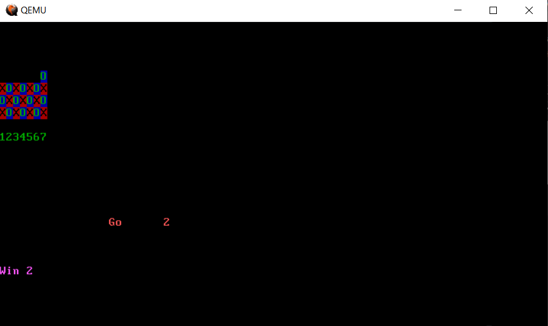

# 4-in-a-row in the boot sector

Hello, this is small implementation of the 4 in a row game that fits inside the boot sector.
Written in NASM (https://www.nasm.us/).
To build it you will need nasm and qemu for x86. On ubuntu do `sudo apt-get install nasm qemu`

to buid run: `make`. to play: `make boot`

Play with keys 1..7
